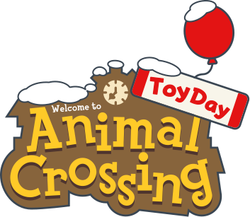

<div align="center">
  
</div>

# Animal Crossing: Toy Day

A multiplayer board game-style web application themed around Animal Crossing's Toy Day event. Players gather resources, shop for items, and prepare gifts to earn points in this festive turn-based game.

## Overview

Toy Day is an interactive web game where 2-4 players compete to earn the most points by gathering resources, purchasing items, and preparing gifts. The game captures the charm of Animal Crossing with authentic music, sound effects, and pixel-perfect item sprites.

## Game Features

### Character Customization
- Choose your villager avatar from dozens of Animal Crossing characters
- Select your island's native fruit (affects resource gathering values)
- Each player gets unique colors and starting resources

### Gameplay Phases

**Gather Resources**
- Shake trees for fruit (1-3 per action)
- Fish in rivers (requires Fishing Rod)
- Catch bugs in forests (requires Bug Net)
- Dive for sea creatures (requires Wet Suit)
- Dig up fossils on beaches (requires Shovel)

**Shop at Nook's Cranny**
- Buy furniture and tools with Bells
- Sell collected resources for profit
- Shop inventory refreshes each round

**Prepare Gifts**
- Drag items from inventory to gift slots
- Choose wrapping paper color (red, green, or blue)
- Each gift earns base points from item value
- Strategic gift combinations can earn bonus points

### Scoring System
- Gift points: Based on item values and special tag bonuses
- Bell points: 1 point per 100 Bells remaining
- Player with highest total points wins

## Tech Stack

- **React 18** - UI framework
- **TypeScript** - Type safety
- **Emotion** - CSS-in-JS styling
- **Webpack 5** - Module bundling
- **Phosphor Icons** - Icon library
- **Fast Average Color** - Dynamic color theming

## Project Structure

```
src/
├── app/
│   ├── components/      # Reusable UI components
│   ├── context/         # Game state and music management
│   ├── helper/          # Utility functions
│   ├── hooks/           # Custom React hooks
│   ├── pages/           # Game phase pages
│   └── types/           # TypeScript type definitions
├── data/                # JSON data for items, music, villagers
└── main.tsx            # Application entry point

public/
├── assets/
│   ├── icons/          # Item and character sprites
│   ├── sounds/         # 328 authentic AC sound effects
│   └── favicons/       # App icons
└── fonts/              # Official AC fonts
```

## Getting Started

### Prerequisites
- Node.js 16+
- npm or yarn

### Installation

```bash
npm install
```

### Development

```bash
npm run dev
```

Starts development server at `http://localhost:3000` with hot reload enabled.

### Build

```bash
npm run build
```

Generates production build in `dist/` directory.

### Format Code

```bash
npm run format
```

Formats all TypeScript/JavaScript files using Prettier.

## Game Rules

### Setup
- 2-4 players
- Default: 6 rounds, 2 actions per turn
- Starting bells: 5000 per player

### Actions per Turn
Players choose one of three actions:
1. Gather Resources - Collect items to sell or gift
2. Shop Items - Buy or sell at Nook's Cranny
3. Prepare Gifts - Wrap items for points

### Winning Strategy
- Balance resource gathering with shopping
- Buy rare items early before they sell out
- Tools unlock valuable resource types
- Plan gift combinations for bonus points
- Manage Bells carefully for end-game scoring

## Audio Features

- **Dynamic Music System**: Background music changes based on game phase
- **Sound Effects**: 328 authentic Animal Crossing sound effects
- **Tracks Include**:
  - Morning themes for gathering
  - Shop themes for Nook's Cranny
  - Festive Toy Day music for results
  - Character creation themes

## Development Notes

### Code Standards
- PascalCase for React components
- UPPER_SNAKE_CASE for constants
- kebab-case for CSS classes
- Pure functions preferred
- Modern ES6+ syntax
- No code comments (self-documenting code)

### Key Technologies
- **Emotion CSS**: Nested selectors, dynamic theming
- **Context API**: Global state management
- **Custom Hooks**: Drag-and-drop, color extraction, keyboard handling
- **Webpack Aliases**: Clean imports with @ prefixes

## Debug Mode

Access debug tools at `#debug` route to test game states and inspect player data.

## Credits

All Animal Crossing assets, characters, music, and sound effects are property of Nintendo. This is a fan-made project created for educational purposes.

## License

This project is not licensed for commercial use. All Animal Crossing intellectual property belongs to Nintendo.

